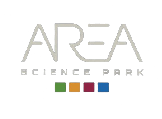

  

# BC-pipelines 🧬 
This project contains some Jenkins-pipeline created to perform Basecalling on the Orfeo cluster at AreaSciencePark. This project is based on the Master degree thesis of Rodolfo Tolloi. To se a full documentation about this software and how to use it, click [here](https://rodtol.github.io/BC-pipelines/)

## Requirements:
The 

## Usage
The file in this project are thought to be run on [Orfeo](https://orfeo-doc.areasciencepark.it/), so they are not fully generalized for any system, and if a user wish to run on its custom platform it will require to adapt different files.  
Given this premise, the basic requirements are:
- Python3 : installed on every node. [Here](/BC_software/requirements.txt) you can find a list of the packages used by the software.
- Dorado: the dorado_server and the ont_basecaller_supervisor are the two componets that actually performs the basecalling. You can find the standlone dorado basecaller software [here](https://github.com/nanoporetech/dorado), but the server version and the ont_basecaller_supervisor are accesible only to "full" members of the ONT community.

## Repository structure 
The repository is organized in the following way:  
- [basecalling-pipeline](docs/Basecalling-pipeline.md): a directory with the jenkinsfile that defines the pipeline for basecalling.
- [configurations](Configuration.md): the directory containing the JSON file with all the settings for a run.
- [BC_software](docs/BC_software.md): this directory contains the "BC_software" that enables the parallelizzation across multiple nodes of the basecalling process.
- [BC_scripts](docs/BC_scripts.md): here you'll find some bash and python scripts. They are used by both the pipeline itself and the BC_software to setup and launch the whole basecalling process.

## TODO
See [here](docs/todo.md).

