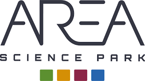

  

# BC-pipelines 🧬
This project contains some Jenkins-pipeline created to perform Basecalling on the Orfeo cluster at AreaSciencePark. This project is based on the Master degree thesis of Rodolfo Tolloi. 

## Repository structure
The repository is organized in the following way:  
- [BC_software](BC_software.md): this directory contains the "BC_software" that enables the parallelizzation across multiple nodes of the basecalling process. TESTONE
- [BC_scripts](BC_scripts.md): here you'll find some bash and python scripts. They are used by both the pipeline itself, the BC_software to setup and launch the whole process.
- [basecalling-pipeline](Basecalling-pipeline.md): a directory with the jenkinsfile that defines the pipeline for basecalling.
- [configurations](Configuration.md): the directory containing the JSON file with all the settings for a run.

## TODO
See [TODO](/docs/todo.md).